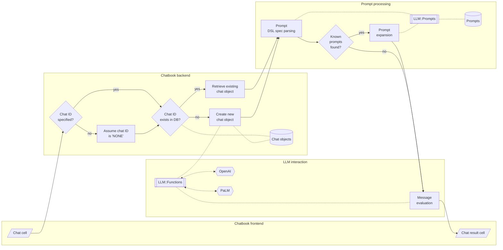

# LLM::Prompts

## In brief

This repository is for a Raku (data) package facilitating the creation, storage, retrieval, and curation of 
[Large Language Models (LLM) prompts](https://en.wikipedia.org/wiki/Prompt_engineering).

Here is an example of using the prompt Domain Specific Language (DSL) in Jupyter chatbook, [AA2, AAp2]:


----

## Installation

From Zef' ecosystem:

```
zef install LLM::Prompts
```

From GitHub:

```
zef install https://github.com/antononcube/Raku-LLM-Prompts.git
```

-----

## Usage examples

### Retrieval

Load the packages "LLM::Prompts", [AAp1], and "LLM::Functions", [AAp2]:

```perl6
use LLM::Prompts;
use LLM::Functions;
```

Show the record of the prompt named "FTFY":

```perl6
.say for |llm-prompt-data<FTFY>;
```

Here is an example of retrieval of prompt data with a regex that is applied over the prompt names:

```perl6
.say for llm-prompt-data(/Sc/)
```

More prompt retrieval examples are given in the section "Prompt data" below.

### LLM functions based on prompts

Make an LLM function from the prompt named "FTFY":

```perl6
my &f = llm-function(llm-prompt('FTFY'));
```

Use the LLM function to correct the grammar of sentence:

```perl6
&f('Where does he works now?')
```

Generate Raku code using the prompt "CodeWriter":

```perl6, output-lang=perl6, output-prompt=NONE
llm-synthesize([llm-prompt('CodeWriter'), "Simulate a random walk."])
```

### Prompt expansion

Prompt expansion using the chatbook prompt spec DSL described in [SW1] 
can be done using the function `llm-prompt-expand`:  

```perl6
llm-prompt-expand('What is an internal combustion engine? #ELI5')
```

Here we get the actual LLM answer:

```perl6
use Text::Utils :ALL;

'What is an internal combustion engine? #ELI5' 
        ==> llm-prompt-expand() 
        ==> llm-synthesize() 
        ==> wrap-paragraph() 
        ==> join("\n") 
```

Here is another example using a persona and two modifiers:

```perl6
my $prmt = llm-prompt-expand("@SouthernBelleSpeak What is light travel distance to Mars? #ELI5 #Moodified|sad")
```

Here we get the actual LLM answer:

```perl6
$prmt 
        ==> llm-prompt-expand() 
        ==> llm-synthesize()
        ==> wrap-paragraph()
        ==> join("\n") 
```

-----

## Prompt spec DSL

A more formal description of the Domain Specific Language (DSL) for specifying prompts
has the following elements: 

- Prompt personas can be "addressed" with "@". For example:

```
@Yoda Life can be easy, but some people instist for it to be difficult.
```

- One or several modifier prompts can be specified at the end of the prompt spec. For example:

```
Summer is over, school is coming soon. #HaikuStyled
```

```
Summer is over, school is coming soon. #HaikuStyled #Translated|Russian
```

- Functions can be specified to be applied "cell-wide" with "!" and placing the prompt spec at
  the start of the prompt spec to be expanded. For example:

```
!Translated|Portuguese Summer is over, school is coming soon
```

- Functions can be specified to be applied to "previous" messages with "!" and 
  placing just the prompt with one of the pointers "^" or "^^". 
  The former means "the last message", the latter means "all messages."
    - The messages can be provided with the option argument `:@messages` of `llm-prompt-expand`.
- For example:

```
!ShortLineIt^
```

- Here is a table of prompt expansion specs (more or less the same as the one in [SW1]):

| Spec               | Interpretation                                      |
|:-------------------|:----------------------------------------------------|
| @*name*            | Direct chat to a persona                            |
| #*name*            | Use modifier prompts                                |
| !*name*            | Use function prompt with the input of current cell  |
| !*name*>           | *«same as above»*                                   |
| &*name*>           | *«same as above»*                                   |
| !*name*^           | Use function prompt with previous chat message      |
| !*name*^^          | Use function prompt with all previous chat messages |
| !*name*￨*param*... | Include parameters for prompts                      |

**Remark:** The function prompts can have both sigils "!" and "&".

**Remark:** Prompt expansion make the usage of LLM-chatbooks much easier.
See "Jupyter::Chatbook", [AAp3].

-----

## Prompt data

Here is how the prompt data can be obtained:

```perl6
llm-prompt-data.elems
```

Here is an example of retrieval of prompt data with a regex that is applied over the prompt names:

```perl6
.say for llm-prompt-data(/Em/, fields => <Description Categories>)
```

In many cases it is better to have the prompt data -- or any data -- in long format.
Prompt data in long format can be obtained with the function `llm-prompt-dataset`:

```perl6
use Data::Reshapers;
use Data::Summarizers;

llm-prompt-dataset.pick(6)
        ==> to-pretty-table(align => 'l', field-names => <Name Description Variable Value>)
```

Here is a breakdown of the prompts categories:

```perl6
select-columns(llm-prompt-dataset, <Variable Value>).grep({ $_<Variable> eq 'Categories' })».deepmap(*.Str)
==> records-summary
```

Here are obtained all modifier prompts in compact format:

```perl6
llm-prompt-dataset():modifiers:compact ==> to-pretty-table(field-names => <Name Description Categories>, align => 'l')
```

**Remark:** The adverbs `:functions`, `:modifiers`, and `:personas` mean 
that *only* the prompts with the corresponding categories will be returned.

**Remark:** The adverbs `:compact`, `:functions`, `:modifiers`, and `:personas` 
have the respective shortcuts `:c`, `:f`, `:m`, and `:p`.


-----

## Implementation notes

### Prompt collection

The original (for this package) collection of prompts was a (not small) sample of the prompt texts
hosted at [Wolfram Prompt Repository](https://resources.wolframcloud.com/PromptRepository/) (WPR), [SW2].
All prompts from WPR in the package have the corresponding contributors and URLs to the corresponding WPR pages.  

Example prompts from Google/Bard/PaLM and ~~OpenAI/ChatGPT~~ are added using the format of WPR. 

### Extending the prompt collection

It is essential to have the ability to programmatically add new prompts.
(Not implemented yet -- see the TODO section below.)

### Prompt expansion

Initially prompt DSL grammar and corresponding expansion actions were implemented.
Having a grammar is most likely not needed, though, and it is better to use "prompt expansion" (via regex-based substitutions.)

Prompts can be "just expanded" using the sub `llm-prompt-expand`. 

### Usage in chatbooks

Here is a flowchart that summarizes prompt parsing and expansion in chat cells of Jupyter chatbooks, [AAp3]:



Here is an example of prompt expansion in a generic LLM chat cell and chat meta cell 
showing the content of the corresponding chat object:


-------

## Command Line Interface

### Playground access

The package provides a Command Line Interface (CLI) script:

```shell
llm-prompt --help
```

Here is an example with a prompt name:

```shell
llm-prompt NothingElse RAKU
```


Here is an example with a regex:

```shell
llm-prompt 'rx/ ^ N .* /'
```


-----

## TODO

- [ ] TODO Implementation
  - [X] DONE Prompt retrieval adverbs
  - [X] DONE Prompt DSL grammar and actions
  - [X] DONE Prompt spec expansion
  - [X] DONE CLI for prompt retrieval
  - [ ] MAYBE CLI for prompt dataset
  - [ ] TODO Addition of user/local prompts 
    - [X] DONE Using XDG data directory.
    - [X] DONE Prompt stencil
    - [X] DONE User prompt ingestion and addition to the main prompts
    - [ ] TODO By modifying existing prompts.
    - [ ] TODO Automatic prompt template fill-in.
    - [ ] TODO Guided template fill-in.
      - [ ] TODO DSL based
      - [ ] TODO LLM based
- [X] DONE Add more prompts
  - [X] DONE Google's Bard example prompts
  - [X] CANCELED OpenAI's ChatGPT example prompts
  - [X] [ProfSynapse prompt](https://github.com/ProfSynapse/Synapse_CoR)
  - [X] Google [OR-Tools](https://developers.google.com/optimization) prompt
- [ ] TODO Documentation
  - [X] DONE Querying (ingested) prompts
  - [X] DONE Prompt DSL
  - [X] DONE Daily joke via CLI
  - [ ] TODO Prompt format
  - [ ] TODO On hijacking prompts
  - [ ] TODO Diagrams
    - [X] DONE Chatbook usage 
    - [ ] Typical usage


-----

## References

### Articles

[AA1] Anton Antonov,
["Workflows with LLM functions"](https://rakuforprediction.wordpress.com/2023/08/01/workflows-with-llm-functions/),
(2023),
[RakuForPrediction at WordPress](https://rakuforprediction.wordpress.com).

[SW1] Stephen Wolfram,
["The New World of LLM Functions: Integrating LLM Technology into the Wolfram Language"](https://writings.stephenwolfram.com/2023/05/the-new-world-of-llm-functions-integrating-llm-technology-into-the-wolfram-language/),
(2023),
[Stephen Wolfram Writings](https://writings.stephenwolfram.com).

[SW2] Stephen Wolfram,
["Prompts for Work & Play: Launching the Wolfram Prompt Repository"](https://writings.stephenwolfram.com/2023/06/prompts-for-work-play-launching-the-wolfram-prompt-repository/),
(2023),
[Stephen Wolfram Writings](https://writings.stephenwolfram.com).

### Packages, paclets, repositories

[AAp1] Anton Antonov,
[LLM::Prompts Raku package](https://github.com/antononcube/Raku-LLM-Prompts),
(2023),
[GitHub/antononcube](https://github.com/antononcube).

[AAp2] Anton Antonov,
[LLM::Functions Raku package](https://github.com/antononcube/Raku-LLM-Functions),
(2023),
[GitHub/antononcube](https://github.com/antononcube).

[AAp3] Anton Antonov,
[Jupyter::Chatbook Raku package](https://github.com/antononcube/Raku-Jupyter-Chatbook),
(2023),
[GitHub/antononcube](https://github.com/antononcube).

[WRIr1] Wolfram Research, Inc.,
[Wolfram Prompt Repository](https://resources.wolframcloud.com/PromptRepository)


