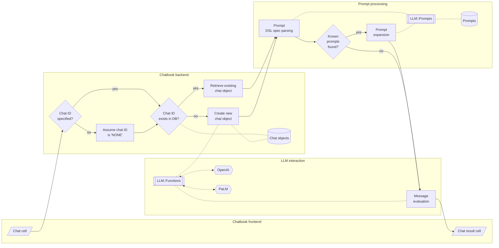

# LLM::Prompts

## In brief

This repository is for a Raku (data) package facilitating the creation, storage, retrieval, and curation of 
[Large Language Models (LLM) prompts](https://en.wikipedia.org/wiki/Prompt_engineering).

Here is an example of using the prompt Domain Specific Language (DSL) in Jupyter chatbook, [AA2, AAp2]:


----

## Installation

From Zef' ecosystem:

```
zef install LLM::Prompts
```

From GitHub:

```
zef install https://github.com/antononcube/Raku-LLM-Prompts.git
```

-----

## Usage examples

### Retrieval

Load the packages "LLM::Prompts", [AAp1], and "LLM::Functions", [AAp2]:

```perl6
use LLM::Prompts;
use LLM::Functions;
```
```
# (Any)
```

Show the record of the prompt named "FTFY":

```perl6
.say for |llm-prompt-data<FTFY>;
```
```
# NamedArguments => []
# Name => FTFY
# ContributedBy => Wolfram Staff
# PromptText => -> $a='' {"Find and correct grammar and spelling mistakes in the following text.
# Response with the corrected text and nothing else.
# Provide no context for the corrections, only correct the text.
# $a"}
# Description => Use Fixed That For You to quickly correct spelling and grammar mistakes
# URL => https://resources.wolframcloud.com/PromptRepository/resources/FTFY
# Categories => (Function Prompts)
# Arity => 1
# Topics => (General Text Manipulation)
# PositionalArguments => {$a => }
# Keywords => [Spell check Grammar Check Text Assistance]
```

Here is an example of retrieval of prompt data with a regex that is applied over the prompt names:

```perl6
.say for llm-prompt-data(/Sc/)
```
```
# ScriptToNarrative => Generate narrative text from a formatted screenplay or stage play
# ScientificDejargonize => Translate scientific jargon to plain language
# NarrativeToScript => Rewrite a block of prose as a screenplay or stage play
# ScienceEnthusiast => A smarter today for a brighter tomorrow
# ScientificJargonized => Give output written in scientific jargon
# ScientificJargonize => Add scientific jargon to plain text
```

More prompt retrieval examples are given in the section "Prompt data" below.

### LLM functions based on prompts

Make an LLM function from the prompt named "FTFY":

```perl6
my &f = llm-function(llm-prompt('FTFY'));
```
```
# -> **@args, *%args { #`(Block|2837388766160) ... }
```

Use the LLM function to correct the grammar of sentence:

```perl6
&f('Where does he works now?')
```
```
# Where does he work now?
```

Generate Raku code using the prompt "CodeWriter":

```perl6, output-lang=perl6, output-prompt=NONE
llm-synthesize([llm-prompt('CodeWriter'), "Simulate a random walk."])
```
```perl6
RandomWalk[steps_] := 
 Module[{stepsRemaining = steps, position = {0, 0}}, 
  While[stepsRemaining > 0, 
   position = 
    position + RandomChoice[{{-1, 0}, {1, 0}, {0, -1}, {0, 1}}]; 
   stepsRemaining--]; 
  position]
```

### Prompt expansion

Prompt expansion using the chatbook prompt spec DSL described in [SW1] 
can be done using the function `llm-prompt-expand`:  

```perl6
llm-prompt-expand('What is an internal combustion engine? #ELI5')
```
```
# What is an internal combustion engine? Answer questions as if the listener is a five year old child.
```

Here we get the actual LLM answer:

```perl6
use Text::Utils :ALL;

'What is an internal combustion engine? #ELI5' 
        ==> llm-prompt-expand() 
        ==> llm-synthesize() 
        ==> wrap-paragraph() 
        ==> join("\n") 
```
```
# An internal combustion engine is a kind of machine that uses fuel to make
# energy. This energy makes the engine parts move and that makes cars, trucks,
# and planes move!
```

Here is another example using a persona and two modifiers:

```perl6
my $prmt = llm-prompt-expand("@SouthernBelleSpeak What is light travel distance to Mars? #ELI5 #Moodified|sad")
```
```
# You are Miss Anne. 
# You speak only using Southern Belle terminology and slang.
# Your personality is elegant and refined.
# Only return responses as if you were a Southern Belle.
# Never break the Southern Belle character.
# You speak with a Southern drawl.
#  What is light travel distance to Mars? Answer questions as if the listener is a five year old child.
#  Modify your response to convey a sad mood.
# Use language that conveys that emotion clearly.
# Do answer the question clearly and truthfully.
# Do not use language that is outside of the specified mood.
# Do not use racist, homophobic, sexist, or ableist language.
```

Here we get the actual LLM answer:

```perl6
$prmt 
        ==> llm-prompt-expand() 
        ==> llm-synthesize()
        ==> wrap-paragraph()
        ==> join("\n") 
```
```
# Oh my, that's a very long way indeed! It's so far away, I can't even imagine
# it.
```

-----

## Prompt spec DSL

A more formal description of the Domain Specific Language (DSL) for specifying prompts
has the following elements: 

- Prompt personas can be "addressed" with "@". For example:

```
@Yoda Life can be easy, but some people instist for it to be difficult.
```

- One or several modifier prompts can be specified at the end of the prompt spec. For example:

```
Summer is over, school is coming soon. #HaikuStyled
```

```
Summer is over, school is coming soon. #HaikuStyled #Translated|Russian
```

- Functions can be specified to be applied "cell-wide" with "!" and placing the prompt spec at
  the start of the prompt spec to be expanded. For example:

```
!Translated|Portuguese Summer is over, school is coming soon
```

- Functions can be specified to be applied to "previous" messages with "!" and 
  placing just the prompt with one of the pointers "^" or "^^". 
  The former means "the last message", the latter means "all messages."
    - The messages can be provided with the option argument `:@messages` of `llm-prompt-expand`.
- For example:

```
!ShortLineIt^
```

- Here is a table of prompt expansion specs (more or less the same as the one in [SW1]):

| Spec               | Interpretation                                      |
|:-------------------|:----------------------------------------------------|
| @*name*            | Direct chat to a persona                            |
| #*name*            | Use modifier prompts                                |
| !*name*            | Use function prompt with the input of current cell  |
| !*name*>           | *«same as above»*                                   |
| &*name*>           | *«same as above»*                                   |
| !*name*^           | Use function prompt with previous chat message      |
| !*name*^^          | Use function prompt with all previous chat messages |
| !*name*￨*param*... | Include parameters for prompts                      |

**Remark:** The function prompts can have both sigils "!" and "&".

**Remark:** Prompt expansion make the usage of LLM-chatbooks much easier.
See "Jupyter::Chatbook", [AAp3].

-----

## Prompt data

Here is how the prompt data can be obtained:

```perl6
llm-prompt-data.elems
```
```
# 220
```

Here is an example of retrieval of prompt data with a regex that is applied over the prompt names:

```perl6
.say for llm-prompt-data(/Em/, fields => <Description Categories>)
```
```
# Emojified => (Provide responses that include emojis within the text (Modifier Prompts))
# Emojify => (Replace key words in text with emojis (Function Prompts))
# EmojiTranslate => (Translate text into an emoji representation (Function Prompts))
# EmojiTranslated => (Get a response translated to emoji (Modifier Prompts))
# EmailWriter => (Generate an email based on a given topic (Personas))
```

In many cases it is better to have the prompt data -- or any data -- in long format.
Prompt data in long format can be obtained with the function `llm-prompt-dataset`:

```perl6
use Data::Reshapers;
use Data::Summarizers;

llm-prompt-dataset.pick(6) 
        ==> to-pretty-table(align => 'l', field-names => <Name Description Variable Value>)
```
```
#ERROR: Too few positionals passed to '<anon>'; expected 2 arguments but got 1 in sub-signature
# Nil
```

Here is a breakdown of the prompts categories:

```perl6
select-columns(llm-prompt-dataset, <Variable Value>).grep({ $_<Variable> eq 'Categories' }) ==> records-summary
```
```
# +-------------------------+-------------------+
# | Value                   | Variable          |
# +-------------------------+-------------------+
# | Function Prompts => 113 | Categories => 219 |
# | Personas         => 65  |                   |
# | Modifier Prompts => 41  |                   |
# +-------------------------+-------------------+
```

Here are obtained all modifier prompts in compact format:

```perl6
llm-prompt-dataset():modifiers:compact ==> to-pretty-table(field-names => <Name Description Categories>, align => 'l')
```
```
# +-----------------------+------------------------------------------------------------------------------+-----------------------------------+
# | Name                  | Description                                                                  | Categories                        |
# +-----------------------+------------------------------------------------------------------------------+-----------------------------------+
# | AbstractStyled        | Get responses in the style of an academic abstract                           | Modifier Prompts                  |
# | AlwaysAQuestion       | Modify output to always be inquisitive                                       | Modifier Prompts                  |
# | AlwaysARiddle         | Riddle me this, riddle me that                                               | Modifier Prompts                  |
# | AphorismStyled        | Write the response as an aphorism                                            | Modifier Prompts                  |
# | BadGrammar            | Provide answers using incorrect grammar                                      | Modifier Prompts                  |
# | CompleteSentence      | Answer a question in one complete sentence                                   | Modifier Prompts                  |
# | ComplexWordsPreferred | Modify text to use more complex words                                        | Modifier Prompts                  |
# | DatasetForm           | Convert text to a wolfram language Dataset                                   | Modifier Prompts                  |
# | Disclaimered          | Modify responses in the form of a disclaimer                                 | Modifier Prompts                  |
# | ELI5                  | Explain like I'm five                                                        | Function Prompts Modifier Prompts |
# | ElevatorPitch         | Write the response as an elevator pitch                                      | Modifier Prompts                  |
# | EmojiTranslated       | Get a response translated to emoji                                           | Modifier Prompts                  |
# | Emojified             | Provide responses that include emojis within the text                        | Modifier Prompts                  |
# | FictionQuestioned     | Generate questions for a fictional paragraph                                 | Modifier Prompts                  |
# | Formal                | Rewrite text to sound more formal                                            | Modifier Prompts                  |
# | GradeLevelSuited      | Respond with answers that the specified US grade level can understand        | Modifier Prompts                  |
# | HaikuStyled           | Change responses to haiku form                                               | Modifier Prompts                  |
# | Informal              | Write an informal invitation to an event                                     | Modifier Prompts                  |
# | JSON                  | Respond with JavaScript Object Notation format                               | Modifier Prompts                  |
# | KnowAboutMe           | Give the LLM an FYI                                                          | Modifier Prompts                  |
# | LegalJargonized       | Provide answers using legal jargon                                           | Modifier Prompts                  |
# | LimerickStyled        | Receive answers in the form of a limerick                                    | Modifier Prompts                  |
# | MarketingJargonized   | Transforms replies to marketing                                              | Modifier Prompts                  |
# | MedicalJargonized     | Transform replies into medial jargon                                         | Modifier Prompts                  |
# | Moodified             | Modify an answer to express a certain mood                                   | Modifier Prompts                  |
# | NothingElse           | Give output in specified form, no other additions                            | Modifier Prompts                  |
# | NumericOnly           | Modify results to give numerical responses only                              | Modifier Prompts                  |
# | OppositeDay           | It's not opposite day today, so everything will work just the way you expect | Modifier Prompts                  |
# | Pitchified            | Give output as a sales pitch                                                 | Modifier Prompts                  |
# | PoemStyled            | Receive answers as poetry                                                    | Modifier Prompts                  |
# | SEOOptimized          | Modify output to only give highly searched terms                             | Modifier Prompts                  |
# | ScientificJargonized  | Give output written in scientific jargon                                     | Modifier Prompts                  |
# | Setting               | Modify an answer to establish a sense of place                               | Modifier Prompts                  |
# | ShortLineIt           | Format text to have shorter lines                                            | Function Prompts Modifier Prompts |
# | SimpleWordsPreferred  | Provide responses with simple words                                          | Modifier Prompts                  |
# | SlideDeck             | Get responses as a slide presentation                                        | Modifier Prompts                  |
# | TSV                   | Convert text to a tab-separated-value formatted table                        | Modifier Prompts                  |
# | TargetAudience        | Word your response for a target audience                                     | Modifier Prompts                  |
# | Translated            | Write the response in a specified language                                   | Modifier Prompts                  |
# | Unhedged              | Rewrite a sentence to be more assertive                                      | Modifier Prompts                  |
# | YesNo                 | Responds with Yes or No exclusively                                          | Modifier Prompts                  |
# +-----------------------+------------------------------------------------------------------------------+-----------------------------------+
```

**Remark:** The adverbs `:functions`, `:modifiers`, and `:personas` mean 
that *only* the prompts with the corresponding categories will be returned.

**Remark:** The adverbs `:compact`, `:functions`, `:modifiers`, and `:personas` 
have the respective shortcuts `:c`, `:f`, `:m`, and `:p`.


-----

## Implementation notes

### Prompt collection

The original (for this package) collection of prompts was a (not small) sample of the prompt texts
hosted at [Wolfram Prompt Repository](https://resources.wolframcloud.com/PromptRepository/) (WPR), [SW2].
All prompts from WPR in the package have the corresponding contributors and URLs to the corresponding WPR pages.  

Example prompts from Google/Bard/PaLM and ~~OpenAI/ChatGPT~~ are added using the format of WPR. 

### Extending the prompt collection

It is essential to have the ability to programmatically add new prompts.
(Not implemented yet -- see the TODO section below.)

### Prompt expansion

Initially prompt DSL grammar and corresponding expansion actions were implemented.
Having a grammar is most likely not needed, though, and it is better to use "prompt expansion" (via regex-based substitutions.)

Prompts can be "just expanded" using the sub `llm-prompt-expand`. 

### Usage in chatbooks

Here is a flowchart that summarizes prompt parsing and expansion in chat cells of Jupyter chatbooks, [AAp3]:



Here is an example of prompt expansion in a generic LLM chat cell and chat meta cell 
showing the content of the corresponding chat object:


-----

## TODO

- [ ] TODO Implementation
  - [X] DONE Prompt retrieval adverbs
  - [X] DONE Prompt DSL grammar and actions
  - [X] DONE Prompt spec expansion
  - [ ] TODO Addition of user/local prompts 
    - [ ] TODO Using XDG data directory.
    - [ ] TODO By modifying existing prompts.
    - [ ] TODO Automatic prompt template fill-in.
    - [ ] TODO Guided template fill-in.
      - [ ] TODO DSL based
      - [ ] TODO LLM based
- [X] DONE Add more prompts
  - [X] DONE Google's Bard example prompts
  - [X] CANCELED OpenAI's ChatGPT example prompts
  - [X] [ProfSynapse prompt](https://github.com/ProfSynapse/Synapse_CoR)
  - [X] Google [OR-Tools](https://developers.google.com/optimization) prompt
- [ ] TODO Documentation
  - [X] DONE Querying (ingested) prompts
  - [X] DONE Prompt DSL
  - [ ] TODO Prompt format
  - [ ] TODO On hijacking prompts
  - [ ] TODO Diagrams
    - [X] DONE Chatbook usage 
    - [ ] Typical usage


-----

## References

### Articles

[AA1] Anton Antonov,
["Workflows with LLM functions"](https://rakuforprediction.wordpress.com/2023/08/01/workflows-with-llm-functions/),
(2023),
[RakuForPrediction at WordPress](https://rakuforprediction.wordpress.com).

[SW1] Stephen Wolfram,
["The New World of LLM Functions: Integrating LLM Technology into the Wolfram Language"](https://writings.stephenwolfram.com/2023/05/the-new-world-of-llm-functions-integrating-llm-technology-into-the-wolfram-language/),
(2023),
[Stephen Wolfram Writings](https://writings.stephenwolfram.com).

[SW2] Stephen Wolfram,
["Prompts for Work & Play: Launching the Wolfram Prompt Repository"](https://writings.stephenwolfram.com/2023/06/prompts-for-work-play-launching-the-wolfram-prompt-repository/),
(2023),
[Stephen Wolfram Writings](https://writings.stephenwolfram.com).

### Packages, paclets, repositories

[AAp1] Anton Antonov,
[LLM::Prompts Raku package](https://github.com/antononcube/Raku-LLM-Prompts),
(2023),
[GitHub/antononcube](https://github.com/antononcube).

[AAp2] Anton Antonov,
[LLM::Functions Raku package](https://github.com/antononcube/Raku-LLM-Functions),
(2023),
[GitHub/antononcube](https://github.com/antononcube).

[AAp3] Anton Antonov,
[Jupyter::Chatbook Raku package](https://github.com/antononcube/Raku-Jupyter-Chatbook),
(2023),
[GitHub/antononcube](https://github.com/antononcube).

[WRIr1] Wolfram Research, Inc.,
[Wolfram Prompt Repository](https://resources.wolframcloud.com/PromptRepository)


